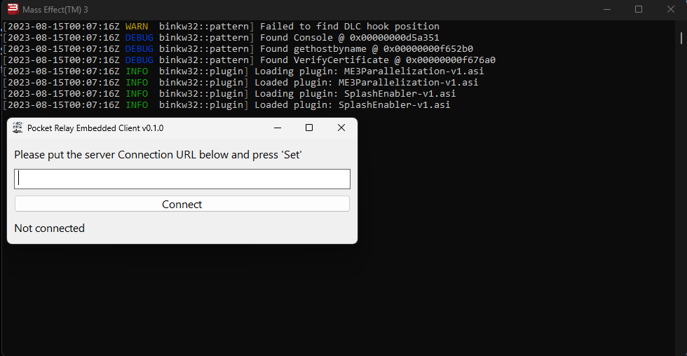

# PocketRelay Embedded Client


[Discord Server (discord.gg/yvycWW8RgR)](https://discord.gg/yvycWW8RgR)

## Table of Contents

- [What](#what) What Pocket Relay Embedded client is
- [Whats different](#whats-different) Whats different between this version and the previous client tool
- [Whats been improved](#whats-been-improved) The improvements over the original tool
- [Installation](#installation) The installation guide
  - [1. Download patch file](#1-download-patch-file) 
  - [2. Open game folder](#2-open-game-folder) 
  - [3. Rename official file](#3-rename-official-file) 
  - [4. Patch game](#4-patch-game) 
  - [5. Done](#5-done) 
- [Manually Building](#manually-building) Instructions for building manually
  - [Requirements](#requirements)
  - [1. Cloning sources](#1-cloning-sources)
  - [2. Adding rust target](#2-adding-rust-target)
  - [3. Building](#3-building)
  - [4. Done](#4-done)
- [Credits](#credits) Credit sources
- [License](#license) Project license

## 📌 EA / BioWare Notice

The **Pocket Relay** software in all its forms are in no way or form supported, endorsed, or provided by BioWare or Electronic Arts. 


## What

This is a new iteration of the **PocketRelay** client to allow you to connect to **Pocket Relay** servers (Mass Effect 3 private servers).

## Whats different

The previous version of the client required being run as administrator and required the user to patch the game using a [binkw32.dll](https://github.com/Erik-JS/masseffect-binkw32) file. 

This new version skips the client step and rather than having the patch and client seperate (requiring the user to patch the game within the client). Instead this version embeds the client UI within a custom patch. This new version also patches hostname lookups which removes the need for running the program as admin because the program no longer needs to access the system hosts file. 

With this new version the user simply replaces the binkw32.dll in their game folder and then whenever the game starts a little popup window will apear where the player can set the **Pocket Relay** server connection URL they would like to use. 



> This also works for the official servers because either closing, or just ignoring this popup window will cause the game to just connect to the official servers instead

## Whats been improved
- Program runs without admin permissions
    - The program is much safer and can be trusted much easier by the users now that it no longer requires any elevated permissions and doesn't modify any system files
    - This is also good for devices where the user doesn't have access to admin permissions
- Improved logging
    - Much easier to diagnose issues with the client now that a dedicated console window can be used to display errors and debug information
- Easier to use
    - Users no longer have to keep around a extra client utility, they just have to patch once then if they want to connect to a server they can enter its address and they're done
- Supports disconnecting
    - You can disconnect from a private server while the game is running and connect back to the official servers (Note: If you've connected back to the official servers you will have to restart your game before you can re-connect to private servers)
- Can close the window 
    - The connection URL window can be closed after you've connected to the server and doesn't need to be kept open like the previous client tool (Note: You cannot close the terminal window or this will also close your game)

## Installation

As this version is still under development there is not currently an automated installer so you must install it yourself

### 1. Download patch file

Download the provided binkw32.dll file

> TODO: There will be a link here when stable releases are available

### 2. Open game folder

Head over to %GAME_FOLDER%/Binaries/Win32/ 

> This should be the same folder as your MassEffect3.exe file, with %GAME_FOLDER% being the actual folder your Mass Effect 3 game is stored in

### 3. Rename official file

> **Note**
> If you have already patched your game previously using another tool that replaces the binkw32.dll (Any modding tools or custom launchers likely applied this patch) you will see there is already a file named binkw23.dll and you can skip this step

In this folder you should see a file named `binkw32.dll` this is the original dll provided with the game, rename this file to `binkw23.dll` (The naming is very important so make sure it matches)

### 4. Patch game 

Copy the provided binkw32.dll file into in the same folder as `binkw23.dll`

> If you've patched your game previously as mentioned in step 3 you can choose to replace the current patched binkw32.dll file with this patch or you can rename that to some other name incase you would like to revert the patch

### 5. Done

Your game should now be patched and you should see the two additional windows pop up when your game starts


## Manually Building

If you would like to manually build the dll you can follow the instructions below

### Requirements
- Git (Optional, but required if you want to clone the repository rather than manually downloading, skip the git steps if you are not using it)
- Rust, Cargo, Rustup (Requires minimum Rust version of 1.70 may not compile on older versions, Rustup is required to add the required i86 target)
- MSVC / Microsoft C++ Build Tools https://learn.microsoft.com/en-us/windows/dev-environment/rust/setup

### 1. Cloning sources

Clone github repository (Skip this step if you have manually downloaded the sources)

```sh
git clone https://github.com/PocketRelay/EmbeddedClient.git
cd EmbeddedClient
```

### 2. Adding rust target

You must add the following rust target to compile (The DLL requires being compiled for 32bit) you can add the target with the following rustup command

> This command only needs to be run for the first setup, and will be already installed for future builds

```sh
rustup target add i686-pc-windows-msvc
```

### 3. Building 

If you manually cloned the repository make sure you have cd'ed into the repository folder

```sh
cargo build --release
```

### 4. Done

The dll should now be built you can find it at

```
target/i686-pc-windows-msvc/release/binkw32.dll
```


## Credits

* WarrantyVoider & Erik-JS - Sourced the patch patterns and offsets for Console, DLC, and VerifyCertificate [Here](https://github.com/Erik-JS/masseffect-binkw32)


## 🧾 License

MIT License

Copyright (c) 2023 Jacobtread

Permission is hereby granted, free of charge, to any person obtaining a copy
of this software and associated documentation files (the "Software"), to deal
in the Software without restriction, including without limitation the rights
to use, copy, modify, merge, publish, distribute, sublicense, and/or sell
copies of the Software, and to permit persons to whom the Software is
furnished to do so, subject to the following conditions:

The above copyright notice and this permission notice shall be included in all
copies or substantial portions of the Software.

THE SOFTWARE IS PROVIDED "AS IS", WITHOUT WARRANTY OF ANY KIND, EXPRESS OR
IMPLIED, INCLUDING BUT NOT LIMITED TO THE WARRANTIES OF MERCHANTABILITY,
FITNESS FOR A PARTICULAR PURPOSE AND NONINFRINGEMENT. IN NO EVENT SHALL THE
AUTHORS OR COPYRIGHT HOLDERS BE LIABLE FOR ANY CLAIM, DAMAGES OR OTHER
LIABILITY, WHETHER IN AN ACTION OF CONTRACT, TORT OR OTHERWISE, ARISING FROM,
OUT OF OR IN CONNECTION WITH THE SOFTWARE OR THE USE OR OTHER DEALINGS IN THE
SOFTWARE.